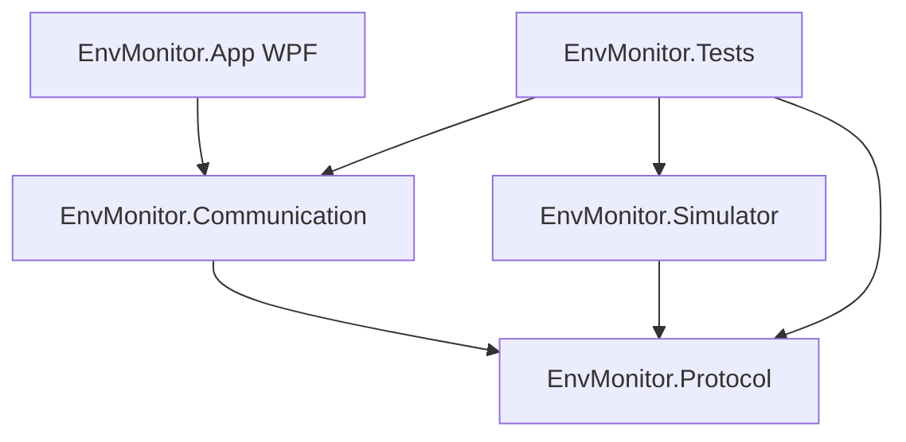

# EnvMonitor

一个同时支持 TCP 模拟下位机和 STM32F103C8T6 实物联调的 C# 环境监控上位机 Demo。项目保留 TCP 模拟器，并在 WPF 中增加 STM32 LED 控制页签，通过 USB CDC/串口控制常见 PC13 板载 LED。

## 项目结构



- `EnvMonitor.Protocol`: Frame、CRC16 和 FrameParser
- `EnvMonitor.Communication`: TCP 客户端、自动重连和 DeviceService
- `EnvMonitor.Simulator`: 虚拟传感器和故障注入 TCP 服务
- `EnvMonitor.App`: WPF MVVM 监控界面、报警和实时曲线
- `EnvMonitor.Tests`: 协议、服务、TCP 和异常场景测试
- `firmware`: STM32F103C8T6 的 CubeIDE/CubeMX 固件接入说明

## 环境要求

- Windows
- .NET 8 SDK
- WPF 运行环境

## 快速运行

先启动模拟器：

```powershell
dotnet run --project EnvMonitor.Simulator -- --port 9000
```

再启动 WPF 上位机：

```powershell
dotnet run --project EnvMonitor.App
```

点击 `Connect` 后，界面会每秒读取传感器数据。可以操作继电器、查看温度曲线和观察连接状态。

WPF 的第二个 `STM32 LED` 页签用于真实开发板：选择 COM 口和波特率，点击连接后即可发送 PC13 LED 控制命令。没有开发板时，第一个 `Environment monitor` 页签和 TCP 模拟器仍可独立运行。

配置文件位于 `EnvMonitor.App/appsettings.json`，可修改：

- `Device.Host`
- `Device.Port`
- `Device.PollIntervalMs`
- `Device.RequestTimeoutMs`
- `Thresholds.Temperature`
- `Thresholds.Humidity`

日志写入运行目录下的 `logs/app-日期.log`。

## 协议

帧格式：

```text
| 0xAA 0x55 | Length 2B | Cmd 1B | Seq 2B | Payload NB | CRC16 2B |
```

- `Length` 是从帧头到 CRC 的总长度，范围为 9 到 1024，大端序
- `Seq` 使用大端序
- CRC 覆盖帧头到 Payload，不包含 CRC 本身
- CRC 使用 Modbus CRC16，多项式 `0xA001`
- CRC 在线路上低字节在前、高字节在后
- 正常响应复用请求的 `Cmd` 和 `Seq`
- 错误响应的 `Cmd = 请求 Cmd | 0x80`，Payload 为一个错误码

命令表：

| Cmd              | 请求 Payload          | 响应 Payload                                                          |
| ---------------- | --------------------- | --------------------------------------------------------------------- |
| `0x01` Read      | 空                    | 温度 Int16、湿度 UInt16、压力 UInt16，均除以 10，加 Relay Byte，共 7B |
| `0x02` SetRelay  | Channel Byte、On Byte | Channel Byte、On Byte                                                 |
| `0x03` Heartbeat | 空                    | 空                                                                    |

错误码：`0x01` 非法命令，`0x02` 非法 Payload，`0x03` 非法继电器通道。

## 模拟器故障注入

```powershell
dotnet run --project EnvMonitor.Simulator -- --port 9000 --drop 30 --delay 2000
```

支持参数：

- `--drop 30`: 30% 概率丢弃响应
- `--delay 2000`: 响应延迟 2000ms
- `--close-after 10`: 每个连接 10 秒后断开
- `--crc-error 3`: 第 3 个响应损坏 CRC
- `--fragment`: 将响应拆成两次写入
- `--coalesce`: 将同一批次的多个响应合并写入

## STM32F103C8T6 联调

当前上位机通过 USB CDC 或 UART 虚拟串口连接 STM32。常见板载 LED 使用 PC13，通常为低电平点亮。详细的 CubeMX 配置、协议和联调步骤见 [firmware/README.md](firmware/README.md)。

STM32 LED 命令：

| Cmd              | 请求 Payload | 响应 Payload |
| ---------------- | ------------ | ------------ |
| `0x10` SetLed    | LedId、State | LedId、State |
| `0x11` GetLed    | LedId        | LedId、State |
| `0x03` Heartbeat | 空           | 空           |

## 测试与构建

一键执行 Release 构建和测试：

```powershell
.\build.ps1
```

也可以分别执行：

```powershell
dotnet build EnvMonitor.sln --configuration Release --no-restore
dotnet test EnvMonitor.Tests\EnvMonitor.Tests.csproj --configuration Release --no-build
```

当前测试覆盖：

- 协议帧编码、解码、CRC16
- 半包、粘包、垃圾字节和 CRC 恢复
- TCP 请求响应匹配和并发请求
- 超时、Pending 清理和自动重连
- 传感器解析、继电器和心跳
- 丢帧、延迟、CRC 错误、半包、粘包和非法命令

## 异常验证结果

| 场景     | 验证结果                              |
| -------- | ------------------------------------- |
| 丢帧     | 客户端超时，Pending 请求清理          |
| 延迟     | 超过请求超时后抛出 `TimeoutException` |
| CRC 错   | 拆包器丢弃错误帧，客户端超时          |
| 断线     | 状态变为 `Disconnected`，随后自动重连 |
| 粘包     | 一次读取正确拆出多帧                  |
| 半包     | 分次读取后正确拼出完整帧              |
| 非法命令 | 返回错误帧，业务层抛出设备错误        |

## 演示流程

1. 启动模拟器。
2. 启动 WPF 上位机并点击连接。
3. 观察温度、湿度、压力每秒刷新。
4. 切换继电器并确认状态变化。
5. 观察实时温度曲线。
6. 使用 `--close-after` 验证断线重连。
7. 调高模拟器波动或修改阈值，观察报警状态和红色数值。

演示截图和录屏文件应放在项目外部或发布附件中，避免将大文件提交到源代码仓库。
